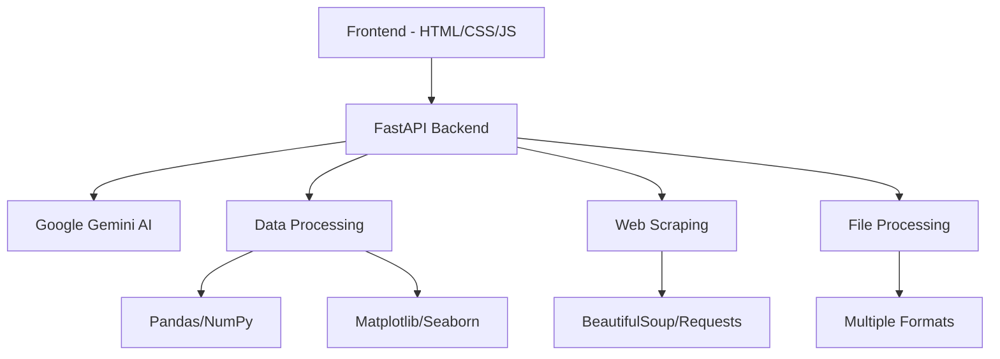

# TDS Data Analyst Agent

<div align="center">


**🤖 AI-Powered Data Analysis Platform**

[](https://www.python.org/)
[](https://fastapi.tiangolo.com/)
[](https://deepmind.google/technologies/gemini/)
[](LICENSE)

*Transform your data into intelligent insights with cutting-edge AI technology*

</div>


[🚀 Quick Start](#quick-start) -  [📊 Features](#features) -  [🛠️ Installation](#installation) -  [📖 Documentation](#documentation) -  [🤝 Contributing](#contributing)


***

## 🌟 Overview

The **TDS Data Analyst Agent** is a revolutionary AI-powered platform that combines the intelligence of Google Gemini with advanced data analysis capabilities. Upload your questions and datasets to receive comprehensive insights, visualizations, and intelligent answers in real-time.

### ✨ Key Highlights

- 🧠 **AI-Powered Analysis** - Leverages Google Gemini 2.5 Pro for intelligent data interpretation
- 📊 **Interactive Visualizations** - Automatic chart generation with matplotlib and seaborn
- 🌐 **Web Scraping** - Intelligent data extraction from URLs and web sources
- 🎨 **Modern UI** - Stunning cyber-punk inspired interface with animations
- 📱 **Responsive Design** - Works seamlessly across all devices
- ⚡ **High Performance** - Optimized for speed with async processing

***

## 🚀 Features

### 🔍 **Intelligent Data Analysis**
- **Natural Language Processing** - Ask questions in plain English
- **Multi-format Support** - CSV, Excel, JSON, Parquet, TXT files
- **Statistical Analysis** - Comprehensive statistical insights
- **Machine Learning** - Advanced ML algorithms for predictions

### 📈 **Visualization Engine**
- **Automatic Chart Generation** - Smart plot selection based on data
- **Interactive Plots** - Hover, zoom, and explore your data
- **Export Capabilities** - High-quality PNG/WebP image output
- **Size Optimization** - Compressed images under 100KB

### 🌐 **Web Intelligence**
- **URL Scraping** - Extract data from web pages and APIs
- **HTML Table Parsing** - Intelligent table detection and extraction
- **Multi-source Integration** - Combine web data with uploaded datasets
- **Error Handling** - Robust scraping with fallback mechanisms

### 🎨 **Premium Interface**
- **Cyber-punk Aesthetic** - Modern, professional design
- **Animated Interactions** - Smooth transitions and micro-animations
- **Glassmorphism Effects** - Backdrop blur and depth
- **Dark Mode** - Eye-friendly interface for extended use

***

## 🛠️ Installation

### Prerequisites

- **Python 3.11+**
- **Google Gemini API Key** ([Get one here](https://makersuite.google.com/app/apikey))
- **Modern Web Browser** (Chrome, Firefox, Safari, Edge)

### Method 1: Using UV (Recommended)

```bash
# Clone the repository
git clone https://github.com/yourusername/tds-data-analyst-agent.git
cd tds-data-analyst-agent

# Install dependencies with UV
uv add fastapi uvicorn python-multipart pandas numpy matplotlib seaborn requests beautifulsoup4 langchain-google-genai langchain python-dotenv openpyxl pillow

# Create environment file
cp .env.example .env
# Edit .env with your Google API key

# Run the application
uv run uvicorn app:app --host 0.0.0.0 --port 8000
```

### Method 2: Using Pip

```bash
# Clone the repository
git clone https://github.com/yourusername/tds-data-analyst-agent.git
cd tds-data-analyst-agent

# Create virtual environment
python -m venv .venv
source .venv/bin/activate  # On Windows: .venv\Scripts\activate

# Install dependencies
pip install -r requirements.txt

# Create environment file
cp .env.example .env
# Edit .env with your Google API key

# Run the application
python app.py
```

### Method 3: Using Docker

```bash
# Clone the repository
git clone https://github.com/yourusername/tds-data-analyst-agent.git
cd tds-data-analyst-agent

# Build and run with Docker
docker build -t tds-analyst .
docker run -p 8000:8000 --env-file .env tds-analyst
```

***

## ⚙️ Configuration

Create a `.env` file in the project root:

```env
# Required: Google Gemini API Configuration
GOOGLE_API_KEY=your_google_gemini_api_key_here
GOOGLE_MODEL=gemini-2.5-pro

# Optional: Performance Settings
LLM_TIMEOUT_SECONDS=120
PORT=8000
MAX_FILE_SIZE_MB=50

# Optional: Development Settings
DEBUG=false
LOG_LEVEL=info
```

### Environment Variables

| Variable | Description | Default | Required |
|----------|-------------|---------|----------|
| `GOOGLE_API_KEY` | Your Google Gemini API key | - | ✅ |
| `GOOGLE_MODEL` | Gemini model version | `gemini-2.5-pro` | ❌ |
| `LLM_TIMEOUT_SECONDS` | Request timeout for AI processing | `120` | ❌ |
| `PORT` | Server port | `8000` | ❌ |
| `MAX_FILE_SIZE_MB` | Maximum upload size | `50` | ❌ |

***

## 📖 Usage

### 1. **Start the Server**

```bash
uv run uvicorn app:app --host 0.0.0.0 --port 8000
```

### 2. **Access the Interface**

Open your browser and navigate to:
- **Main Application**: http://localhost:8000
- **API Documentation**: http://localhost:8000/docs
- **Health Check**: http://localhost:8000/api/health

### 3. **Upload Your Data**

#### Option A: Questions Only
1. Create a `.txt` file with your questions (one per line)
2. Upload via the web interface
3. Let AI scrape relevant data from the web

#### Option B: Questions + Dataset
1. Prepare your questions file (`.txt`)
2. Prepare your dataset (`.csv`, `.xlsx`, `.json`, etc.)
3. Upload both files
4. Get comprehensive analysis

### 4. **Example Questions**

```text
What are the main trends in this dataset?
Create a correlation matrix visualization
What are the top 5 insights from this data?
Generate a summary statistics table
Show the distribution of the target variable
```

### 5. **API Usage**

```python
import requests

# Prepare files
files = {
    'questions_file': open('questions.txt', 'rb'),
    'data_file': open('dataset.csv', 'rb')  # Optional
}

# Send request
response = requests.post('http://localhost:8000/api/analyze', files=files)
results = response.json()

print(results)
```

***

## 🏗️ Architecture

### Tech Stack



### Component Overview

- **🎨 Frontend**: Modern HTML5/CSS3/JavaScript with animations
- **⚡ Backend**: FastAPI with async processing
- **🧠 AI Engine**: Google Gemini 2.5 Pro via LangChain
- **📊 Data Processing**: Pandas, NumPy for data manipulation
- **📈 Visualization**: Matplotlib, Seaborn for charts
- **🌐 Web Scraping**: BeautifulSoup, Requests for data extraction
- **🔧 File Processing**: Support for CSV, Excel, JSON, Parquet

***

## 📚 API Reference

### Endpoints

#### `POST /api/analyze`
**Analyze data with AI**

**Parameters:**
- `questions_file` (required): Text file with questions
- `data_file` (optional): Dataset file

**Response:**
```json
{
  "What are the main trends?": "Based on the analysis...",
  "Create a visualization": "data:image/png;base64,iVBORw0KGgo...",
  "Summary statistics": {...}
}
```

#### `GET /api/health`
**Health check endpoint**

**Response:**
```json
{
  "status": "healthy",
  "timestamp": "2025-01-XX...",
  "configuration": {
    "llmModel": "gemini-2.5-pro",
    "timeoutSeconds": 120
  }
}
```

### Error Handling

The API returns appropriate HTTP status codes:

- `200` - Success
- `400` - Bad Request (invalid file format)
- `413` - Payload Too Large (file size exceeded)
- `408` - Request Timeout (analysis timeout)
- `500` - Internal Server Error

***

## 🎨 UI Features

### Animations & Effects

- **🌊 Floating Particles** - Dynamic background animation
- **✨ Glassmorphism** - Modern blur effects
- **🎯 Hover States** - Interactive element responses
- **📱 Responsive** - Mobile-first design
- **🌙 Dark Theme** - Eye-friendly interface

### File Upload

- **📎 Drag & Drop** - Intuitive file handling
- **📊 Format Support** - Multiple data formats
- **✅ Validation** - Real-time file checking
- **📈 Progress** - Upload progress indicators

### Results Display

- **🤖 AI Responses** - Formatted question-answer pairs
- **📊 Visualizations** - Embedded charts and graphs
- **🔍 Modal View** - Full-screen image viewing
- **💾 Export** - Download results and images

***

## 🧪 Development

### Project Structure

```
tds-data-analyst-agent/
├── app.py                 # Main FastAPI application
├── index.html            # Frontend interface
├── requirements.txt      # Python dependencies
├── .env.example         # Environment template
├── README.md            # This file
├── docs/                # Documentation
│   ├── api.md          # API documentation
│   └── deployment.md   # Deployment guide
├── tests/               # Test files
│   ├── test_app.py     # Application tests
│   └── test_data/      # Test datasets
└── static/              # Static assets (if any)
```

### Running Tests

```bash
# Install test dependencies
pip install pytest pytest-asyncio httpx

# Run tests
pytest tests/ -v

# Run with coverage
pytest tests/ --cov=app --cov-report=html
```

### Development Mode

```bash
# Run with auto-reload
uvicorn app:app --reload --host 0.0.0.0 --port 8000

# Run with debug logging
LOG_LEVEL=debug uvicorn app:app --reload
```

***

## 🚀 Deployment

### Production Deployment

#### Using Docker

```bash
# Build production image
docker build -t tds-analyst:latest .

# Run with production settings
docker run -d \
  --name tds-analyst \
  -p 80:8000 \
  --env-file .env \
  --restart unless-stopped \
  tds-analyst:latest
```

#### Using Systemd

```ini
# /etc/systemd/system/tds-analyst.service
[Unit]
Description=TDS Data Analyst Agent
After=network.target

[Service]
Type=simple
User=www-data
WorkingDirectory=/opt/tds-analyst
Environment=PATH=/opt/tds-analyst/.venv/bin
ExecStart=/opt/tds-analyst/.venv/bin/uvicorn app:app --host 0.0.0.0 --port 8000
Restart=always

[Install]
WantedBy=multi-user.target
```

#### Cloud Platforms

- **🌊 Heroku**: One-click deployment with Procfile
- **☁️ AWS**: ECS/EC2 deployment with load balancing
- **🔷 Azure**: Container instances or App Service
- **🟢 Google Cloud**: Cloud Run or Compute Engine
- **⚡ Vercel**: Serverless deployment option

***

## 🤝 Contributing

We welcome contributions! Here's how to get started:

### 1. Fork & Clone

```bash
git clone https://github.com/yourusername/tds-data-analyst-agent.git
cd tds-data-analyst-agent
```

### 2. Create Branch

```bash
git checkout -b feature/amazing-feature
```

### 3. Development Setup

```bash
# Install development dependencies
pip install -r requirements-dev.txt

# Set up pre-commit hooks
pre-commit install
```

### 4. Make Changes

- 📝 Follow PEP 8 style guidelines
- ✅ Add tests for new features
- 📚 Update documentation
- 🧪 Ensure all tests pass

### 5. Submit PR

```bash
git add .
git commit -m "feat: add amazing feature"
git push origin feature/amazing-feature
```

### Contribution Guidelines

- **🐛 Bug Reports**: Use issue templates
- **💡 Feature Requests**: Discuss in issues first
- **📝 Code Style**: Follow existing patterns
- **🧪 Testing**: Maintain test coverage
- **📚 Documentation**: Update relevant docs

***

## 📄 License

This project is licensed under the MIT License - see the [LICENSE](LICENSE) file for details.

```
MIT License

Copyright (c) 2025 TDS Data Analyst Agent

Permission is hereby granted, free of charge, to any person obtaining a copy
of this software and associated documentation files (the "Software"), to deal
in the Software without restriction, including without limitation the rights
to use, copy, modify, merge, publish, distribute, sublicense, and/or sell
copies of the Software, and to permit persons to whom the Software is
furnished to do so, subject to the following conditions:

The above copyright notice and this permission notice shall be included in all
copies or substantial portions of the Software.
```

***

## 🙏 Acknowledgments

- **Google Gemini** - Powering the AI intelligence
- **FastAPI** - Modern, fast web framework
- **LangChain** - AI application framework
- **Pandas/NumPy** - Data processing backbone
- **Matplotlib/Seaborn** - Visualization libraries
- **Beautiful Soup** - Web scraping capabilities

***

## 📞 Support

### 📧 Contact

- **Email**: support@tds-analyst.com
- **GitHub Issues**: [Report Issues](https://github.com/yourusername/tds-data-analyst-agent/issues)
- **Discussions**: [GitHub Discussions](https://github.com/yourusername/tds-data-analyst-agent/discussions)

### 📚 Resources

- **Documentation**: [Full Documentation](https://docs.tds-analyst.com)
- **API Reference**: [API Docs](https://api.tds-analyst.com)
- **Examples**: [Example Notebooks](https://github.com/yourusername/tds-examples)
- **Blog**: [Latest Updates](https://blog.tds-analyst.com)

### 🆘 Troubleshooting

**Common Issues:**

1. **API Key Error**: Ensure your Google Gemini API key is valid
2. **File Upload Error**: Check file size and format requirements
3. **Timeout Issues**: Increase `LLM_TIMEOUT_SECONDS` for complex analyses
4. **Memory Issues**: Use smaller datasets or increase system memory

***


**⭐ Star this repository if you find it helpful!**

Made with ❤️ by the TDS Team

[🔝 Back to Top](#tds-data-analyst-agent)


***

*Last Updated: January 2025*